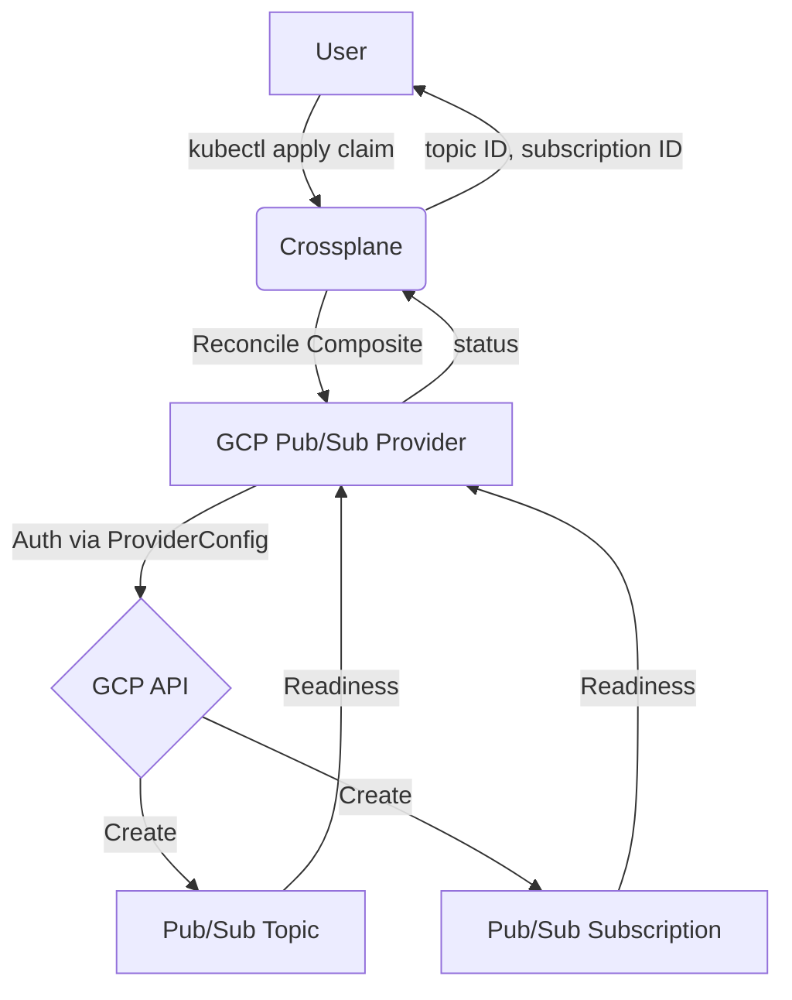
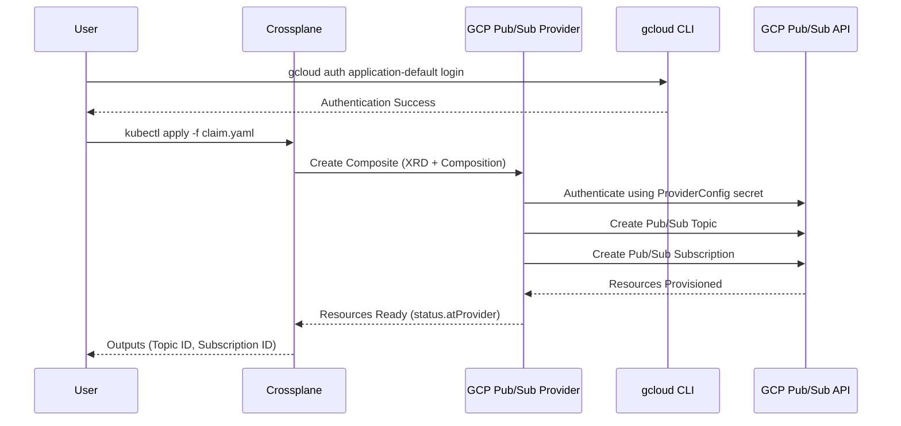

# crossplane-gcp-pubsub

This Crossplane project provisions a Google Pub/Sub topic and subscription for asynchronous messaging.

## Architecture

### Flowchart


### Sequence Diagram


## Pub/Sub Specifications
- **Topic**: Configurable message retention duration (`86600s` default) and labels (`{"environment": "dev"}` default).
- **Subscription**: Supports both push and pull delivery. An empty `pushEndpoint` creates a pull subscription; configuring an endpoint and attributes creates a push subscription.
- **Expiration Policy**: Configurable TTL (`86400s` default).
- **Retry Policy**: Configurable minimum and maximum retry backoff (`10s` / `600s` defaults).
- **Message Ordering**: Optionally enabled (`false` default).
- **Naming**: The managed resource names are derived deterministically from the claim as `<claim-namespace>-<claim-name>-topic` and `...-subscription` (e.g., claim `my-pubsub` in namespace `default` becomes topic resource `default-my-pubsub-topic`). The actual GCP topic/subscription names come from the `topicName` and `subscriptionName` parameters.

## GCP Free Tier Limits (Always Free)
To stay within the free tier, ensure your usage does not exceed:
- **Messages**: 10 GiB of message throughput (publish + subscribe) per month.
- **Cost**: Free for the first 10 GiB per month in all Google Cloud regions; beyond that, throughput is billed per TiB.
- **Regions**: Use `us-west1`, `us-central1`, or `us-east1` (Always Free regions).

## Prerequisites
1.  **A Kubernetes cluster** with **Crossplane** installed.
    ```bash
    # Add the Crossplane Helm repository
    helm repo add crossplane-stable https://charts.crossplane.io/stable
    helm repo update

    # Install Crossplane
    helm install crossplane crossplane-stable/crossplane --namespace crossplane-system --create-namespace
    ```
2.  **kubectl** [configured](https://kubernetes.io/docs/tasks/tools/) to talk to your cluster.
3.  **Google Cloud SDK**: [Installed and initialized](https://cloud.google.com/sdk/docs/install).
4.  **A GCP service account** with the `roles/pubsub.admin` role and a JSON key.

## Setup & Deployment

1.  **Authenticate Locally** (only needed to generate a service account key):
    ```bash
    gcloud auth application-default login
    gcloud config set project your-project-id
    ```

2.  **Create the GCP credentials secret** in the cluster:
    ```bash
    # Base64-encode your service account JSON key
    CREDS=$(base64 -w0 /path/to/service-account-key.json)

    # Create the secret consumed by the ProviderConfig
    kubectl create secret generic gcp-creds \
      --namespace crossplane-system \
      --from-literal=creds="$CREDS"
    ```
    > Alternatively, edit `provider/credentials-secret.yaml` with the base64-encoded key and run `kubectl apply -f provider/credentials-secret.yaml`.

3.  **Install the GCP Pub/Sub Provider**:
    ```bash
    kubectl apply -f provider/provider.yaml

    # Wait until the provider is healthy
    kubectl wait --for=condition=Healthy provider/upbound-provider-gcp-pubsub --timeout=300s
    ```

4.  **Configure the ProviderConfig**:
    Edit `provider/provider-config.yaml` and set your `projectID`, then apply:
    ```bash
    kubectl apply -f provider/provider-config.yaml
    ```

5.  **Deploy the Composition** (XRD + Composition):
    ```bash
    kubectl apply -f composition/xrd.yaml
    kubectl apply -f composition/composition.yaml
    ```

6.  **Create a claim** (this creates the topic and subscription):
    ```yaml
    apiVersion: pubsub.gcp.example.org/v1alpha1
    kind: PubSubTopicClaim
    metadata:
      name: my-pubsub
      namespace: default
    spec:
      projectId: your-project-id
      region: us-central1
      topicName: my-topic
      subscriptionName: my-subscription
    ```
    > Edit `composition/claim.yaml` first and replace the `PROJECT_ID`, `REGION`,
    > `CLAIM_NAME`, and `CLAIM_NAMESPACE` placeholders (or use the example above),
    > then apply it:
    ```bash
    kubectl apply -f composition/claim.yaml
    ```

7.  **Outputs**:
    Wait for the claim to become `Ready` and read the outputs from the claim status:
    ```bash
    kubectl wait --for=condition=Ready \
      pubsubtopicclaims.pubsub.gcp.example.org/my-pubsub \
      --namespace default --timeout=300s

    kubectl get pubsubtopicclaims.pubsub.gcp.example.org/my-pubsub \
      --namespace default \
      -o jsonpath='Topic ID: {.status.topicId}{"\n"}Topic Name: {.status.topicName}{"\n"}Subscription ID: {.status.subscriptionId}{"\n"}Subscription Name: {.status.subscriptionName}{"\n"}'
    ```

### Alternative: Direct Managed Resource

Prefer not to use Compositions? Apply the managed resources directly (no XRD/Composition needed):

```bash
kubectl apply -f examples/pubsub.yaml   # edit it first (project + unique names)
```

## Usage as a Composition

Reference this project as a Crossplane Composition in your own cluster. Since this repo ships the XRD and Composition, any cluster where the GCP Pub/Sub provider is installed can consume the claim directly:

```yaml
apiVersion: pubsub.gcp.example.org/v1alpha1
kind: PubSubTopicClaim
metadata:
  name: orders-pubsub
  namespace: orders
spec:
  projectId: my-project-id
  region: us-central1
  topicName: orders-topic
  subscriptionName: orders-subscription
```

Then reference the created topic from other workloads, for example by reading the claim status:

```bash
kubectl get pubsubtopicclaims.pubsub.gcp.example.org/orders-pubsub \
  --namespace orders \
  -o jsonpath='{.status.topicName}'
```

Or pass the topic/subscription names to an application as environment variables (e.g. using a tool like [external-secrets](https://external-secrets.io) or a Kubernetes controller that syncs claim statuses into ConfigMaps/Secrets).

## Parameters

| Parameter | Description | Type | Default |
|-----------|-------------|------|---------|
| `projectId` | GCP project ID | `string` | (required) |
| `region` | GCP region (free tier: us-west1, us-central1, us-east1) | `string` | `"us-central1"` |
| `topicName` | Pub/Sub topic name | `string` | `"my-topic"` |
| `messageRetentionDuration` | Message retention duration for the topic | `string` | `"86600s"` |
| `labels` | Labels for the topic | `map[string]string` | `{"environment": "dev"}` |
| `subscriptionName` | Pub/Sub subscription name | `string` | `"my-subscription"` |
| `ackDeadlineSeconds` | Acknowledgement deadline in seconds | `integer` | `20` |
| `pushEndpoint` | Push endpoint URL (empty for pull) | `string` | `""` |
| `pushAttributes` | Attributes for the push configuration | `map[string]string` | `{}` |
| `expirationTtl` | Subscription expiration policy TTL | `string` | `"86400s"` |
| `minRetryBackoff` | Minimum retry backoff duration | `string` | `"10s"` |
| `maxRetryBackoff` | Maximum retry backoff duration | `string` | `"600s"` |
| `enableMessageOrdering` | Enables message ordering | `boolean` | `false` |

## Outputs

| Output | Description |
|--------|-------------|
| `topicId` | The ID of the created Pub/Sub topic |
| `topicName` | The name of the created Pub/Sub topic |
| `subscriptionId` | The ID of the created Pub/Sub subscription |
| `subscriptionName` | The name of the created Pub/Sub subscription |

## Resources Created

- `Provider` – `upbound/provider-gcp-pubsub` Crossplane provider package
- `ProviderConfig` – `gcp-provider-config` (GCP credentials + project)
- `CompositeResourceDefinition` – `pubsubtopics.pubsub.gcp.example.org`
- `Composition` – `pubsubtopics.pubsub.gcp.example.org`
- `Topic` – `pubsub.gcp.upbound.io/v1beta1` managed resource (Pub/Sub topic)
- `Subscription` – `pubsub.gcp.upbound.io/v1beta1` managed resource (Pub/Sub subscription)

## CI/CD Setup (GitHub Actions)

### Prerequisites
1.  **Install Crossplane** on a cluster reachable from GitHub Actions.
2.  **Create a GCP service account** with `roles/pubsub.admin` and generate a JSON key:
    - GCP Console → IAM & Admin → Service Accounts → Create Service Account
    - Grant `Pub/Sub Admin` (or `roles/pubsub.admin`)
    - Keys → Add Key → Create New Key → JSON
    - Copy the entire JSON file contents

3.  **Add GitHub secrets**:

    | Secret Name | Value |
    |---|---|
    | `GCP_SA_KEY` | Full JSON key from step 2 |
    | `KUBECONFIG` | Base64-encoded kubeconfig of the Crossplane cluster (`kubectl config view --minify --raw \| base64 -w0`) |

4.  **Run the workflow**:
    - **Apply**: Go to Actions → **CD - GCP Pub/Sub (Apply)** → fill in all inputs
    - **Destroy**: Go to Actions → **CD - GCP Pub/Sub (Destroy)** → fill in the claim name/namespace

## Destroy

To delete the topic, subscription, and all associated resources:

```bash
# Delete the claim -> deletes the composite, topic, and subscription
kubectl delete pubsubtopicclaims.pubsub.gcp.example.org/my-pubsub \
  --namespace default

# Optional: uninstall the provider and its credentials
kubectl delete -f provider/provider.yaml
kubectl delete -f provider/provider-config.yaml
kubectl delete secret gcp-creds --namespace crossplane-system
```
